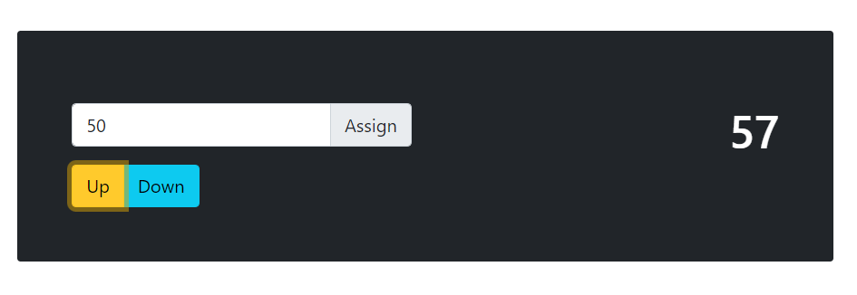

# React Counter App

A simple counter app made with React. See it live [here](https://bg-react-counter-app.netlify.app/).

## Features

-   Count up or down

-   Start the counter from a number of choice

## Dependencies

-   Node version 8.1 or above

## How to run

1. Clone the repository on your machine

2. Run the below commands inside cloned directory

    ```bash
    $ npm install
    $ npm start
    ```

## Screenshots


